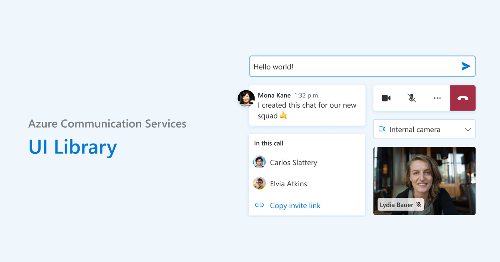

# Azure Communication Services UI Library

Azure Communication Services UI Library is a collection of JavaScript libraries that can be used to easily build fast, responsive communication web applications.

We have interactive storybook pages in our storybook 📖 to try out features and examples to get your development kick started 🚀.

## Getting Started

If you're wondering where to get started, here are a few scenarios to help you get going:

* "What is Azure Communication Services?"
  * Take a look at our conceptual documentation on [Azure Communication Services](https://docs.microsoft.com/azure/communication-services/overview), [Client-Server Architecture](https://docs.microsoft.com/azure/communication-services/concepts/client-and-server-architecture), [Authentication](https://docs.microsoft.com/azure/communication-services/concepts/authentication), [Calling](https://docs.microsoft.com/azure/communication-services/concepts/voice-video-calling/about-call-types) and [Chat](https://docs.microsoft.com/azure/communication-services/concepts/chat/concepts?branch=pr-en-us-152137).
* "I want to see what this library can do!"
  * Check out our [Storybook](https://azure.github.io/communication-ui-library) and [Sample Apps](#samples)
* "I want to write my own communication application"
  * We recommend checking out our [comprehensive documentation](https://azure.github.io/communication-ui-library/?path=/story/overview--page) first to make the best decision for your application.
* "I want more information on the packages available to use"
  * Check out our [npm packages](#npm-packages) on offer
* "I want to submit a fix for a package in this repo"
  * Check out our [making a contribution](<./docs/contributing-guide/1. getting-set-up.md>) guide

## NPM Packages

### @azure/communication-react

A React library providing UI components and  making it simple for you to build modern communication apps using [Azure Communication Services](https://azure.microsoft.com/services/communication-services/).

## Samples

🚧 We are working on polishing up the samples in this repo 🚧.

Check out [Storybook](https://azure.github.io/communication-ui-library) to try out this UI Library today!

## Contributing to the Packages or Samples

Join us by making a contribution. To get you started check out our [making a contribution](<./docs/contributing-guide/1. getting-set-up.md>) guide.

We look forward to building an amazing open source library with you!

## Further Reading

* [Repo Documentation](./docs/README.md)
* [Conceptual Documentation](https://azure.github.io/communication-ui-library/?path=/story/overview--page)
* [Quick-start Documentation](https://azure.github.io/communication-ui-library/?path=/story/quickstarts-composites--page)
