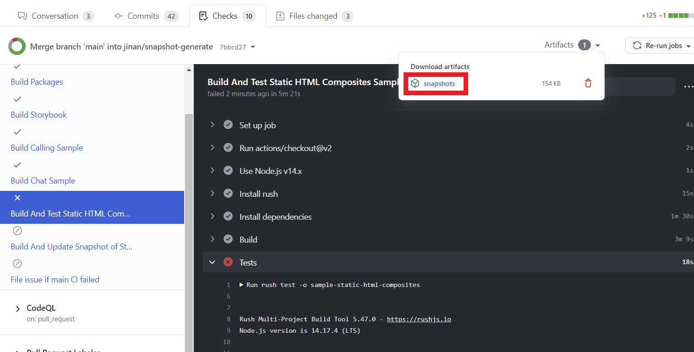

# Contribution Guide

1. [Getting Set up](<./1. getting-set-up.md>)
2. [Building Samples and Packages](<./2. build-samples-and-packages.md>)
3. [Running a Sample or Storybook](<./3. running-a-sample-or-storybook.md>)
4. [Testing your changes](<./4. testing-your-changes.md>)
5. [Writing unit tests](<./5. writing-unit-tests.md>)
6. **[Submitting a PR](<./6. submitting-a-pr.md>)**
7. [Having your changes published](<./7. having-your-changes-published.md>)

## 6. Submitting a PR

### Prerequisites to publishing a Pull Request

Once you have gotten setup with the repo, made and tested your changes, there are two more small checks before submitting your PR:

1. Update any `API` files
1. Generate required change files

#### 0. Update dependencies lock file for all flavors
If you are adding/updating dependencies in any package.json file, you will need to update dependencies lock files for both beta and stable flavors before submitting changes, run these commands to ensure they are correctly generated:

For beta:

`rush update`

For stable:

`rush update:stable`

These commands will update your dependencies locally and generate pnpm-lock.yaml. You might wanna install the right dependencies for your current flavor (by default, run `rush switch-flavor:beta` again for switching back to beta flavor)

#### 1. Update package API files

To ensure we do not break any existing public APIs, we use [api-extractor](../infrastructure/api-extractor.md) across all our npm packages. This generates a file detailing all public exports of the package. You can find this file under `package-root/review/beta/package-name.api.md`. We do this to prevent any accidental breaking changes to the packages we export, and to ensure we do not accidentally publish any internal helper classes/functions.

When a package is built the api-extractor is automatically run and will update the corresponding `api.md` file.

- If you are updating apis under stable version, api update for both beta&stable would be necessary, a quick command to do so is `rush build:all-flavors`, which will build under all flavors and generate api files for both. Or you could also switch to stable flavor by running `rush switch-flavor:stable` and do the step below to generate stable api.md (don't forget to run `rush switch-flavor:beta` when finished if necessary)

To ensure these API files have been updated, run `rush build -t "package-name` for each package you have made changes to and submit any changed `api.md` files along with your PR.

#### 2. Generate a change file to describe your changes

To ensure we have high-quality changelogs when new versions are released, and make sure your contribution does not go unaccredited for, we ask you to create a change file to describe your changes. To generate the change file first make sure all your changes are _committed_, then run:

```bash
rush changelog
```

This will start an interactive tool that will:

1. First ask you to select whether your change is a Major, Minor, or Patch (for more information on which to choose see: [semver docs](https://semver.org/))

1. Then ask for a short description of your change - this is what will be included in the changelog when a new version is released, so keep it concise and meaningful. See [Tips for writing meaningful changelog entries](../reviewer-notes/tips-for-writing-changelog-entries).

### Generating new snapshot for your UI changes

If you are making an ui change in your PR, you might invalidate some screen snapshot in our automation visual tests.

1. Check the failing github actions to see if that is a desired UI change

   
1. Add `update_snapshot` label to the PR
1. Wait github actions to generate new snapshot for your PR
1. Validation pipeline will re-run after new snapshot gets generated

For more details on UI tests and debugging failed UI tests, see [references/automated-tests](../references/automated-tests.md).

### Submitting your PR

You're ready to submit your PR! 🚀 Thank you for your contribution!

Once you have submitted your PR it must pass several automated checks that help keep our packages and repo healthy:

* ✅ At least two reviewers must approve the changes
* ✅ All packages, samples, and storybook must build successfully
* ✅ Unit tests must all pass
* ✅ Linting must succeed without warnings
* ✅ Appropriate change files must be included
* ✅ Check for public API regressions must not fail

---

* Next: [Having your changes published](<./7. having-your-changes-published.md>)
* Previous: [Writing unit tests](<./5. writing-unit-tests.md>)
