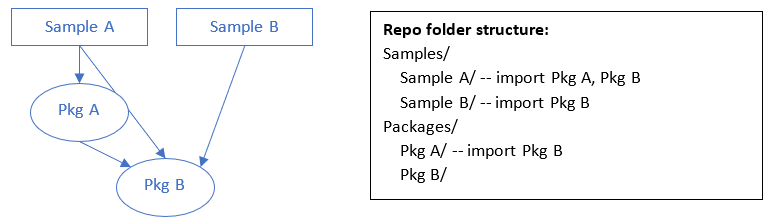

# Rush Monorepo Manager

## What is Rush?

[Rush](https://rushjs.io/pages/intro/welcome/) is a monorepo manager with a lot of different features. Primarily we use Rush for the following:

* Module Linking
* Incremental Builds
* Hot reloading

### Module Linking

Module linking solves the issue whereby projects in a repo have dependencies other projects in the same repo. In our repo we have one or more samples that depend on multiple packages, with each package having a potential downstream dependency on another package. i.e.:

Rush has built in module linking where dependencies of projects are first checked against projects specified in the `rush.json`. If they exist in the rush.json it will create a symlink to that project instead of pulling a package from an npm endpoint.

### Incremental Builds

As mentioned in Module Linking, a project in our repo may have several, local downstream dependencies. It's important that when a project is built, it builds all local dependencies in the correct order, only once, and only if those projects change.

Rush's build command handles this.

### Hot Reloading

Hot reloading is where when a sample or storybook is running and changes are made to local package dependencies, the changes are automatically built and the samples/storybook reloaded.

To achieve this we use a mix of webpack-dev-server that hosts the samples, and a custom Rush command `build:watch`. This command is defined in [common/config/rush/command-line.json](https://github.com/Azure/communication-ui-library/blob/main/common/config/rush/command-line.json).

## Why Rush

We explored a number of options for managing our monorepo ([Yarn workspaces](https://classic.yarnpkg.com/en/docs/workspaces/), [Lerna](https://lerna.js.org/) and [Lage](https://microsoft.github.io/lage/)):

 &nbsp;            | Rush   | Yarn Workspaces | Lerna & Yarn Workspaces | Lage & Yarn Workspaces |
 ----------------- | ------ | --------------- | --------------- | -------------- |
Module Linking     | ✅    |  ✅             | ✅             | ✅             |
Incremental Build  | ✅    |  ❌             | ❌             | ✅             |
Hot Reloading      | ✅    |  ❌             | ❌             | ❌             |
Flexibility        | ❌    |  ✅             | ✅             | ✅             |
Package publishing | ✅    |  ✅             | ✅             | ✅             |
Pros               | All in one solution. Force consistent dependency versions.| Familiar dev env for developers, most lightweight. | Used frequently in OSS projects. | Lage behind yarn commands – creates familiar dev env |
Cons               | Tied into Rush quite tightly. Unfamiliar global rush commands. Symlinks don't work with git clean. | No incremental builds. Needs custom implementation for hot reloading. | Lerna doesn't add value except for publishing - which we are using beachball for. | Lage is new and largely untested. No hot reloading support out-of-box. Definitely an option for the future.

Ultimately with Rush we could get all the features we were looking for in our repo. Yarn workspaces with Lage is an exciting prospect for the future however. Npm workspaces are only available in node v15+ so we did not explore this option to keep our repo more accessible.

## Useful Rush commands

For those familiar with running `npm` commands or `yarn` commands, we have a series of `rush` commands that replace most that should be run instead:

* `npm install` --> `rush update:beta` or `rush update:stable`
* `npm install "package"` --> `rush add -p "package"` (add `--dev` to save to dev dependencies)
* `npm run build` --> `rush build` (from anywhere), `rush build -t "package-name"` (from anywhere) or `rushx build` (from a package or sample directory)
* `npm run start` --> `rushx start`
* `npm run test` --> `rush test` (from anywhere) or `rushx test` (from a package or sample directory)
* `git clean` --> `rush unlink && rush purge`

Other useful commands

* `rush update:beta` or `rush update:stable` -- run this anytime you pull new changes that have changed any package.json
* `rush update:beta -p` -- performs a purge before update
* `rush rebuild` -- performs a full build instead of an incremental build
* `rush lint` -- perform lint across the whole repo
* `rush changelog` -- generate change file for the changelog

Short commands

* `rush sb` --> `rush switch-flavor:beta`
* `rush sbr` --> `rush switch-flavor:beta-release`
* `rush ss` --> `rush switch-flavor:stable`
* `rush ub` --> `rush update:beta`
* `rush us` --> `rush update:stable`
* `rush baf` --> `rush build:all-flavours`
* `rush bapi` --> `rush build-api:all-flavors`
* `rush b` --> `rush build`

For more commands check out the official [docs](https://rushjs.io/pages/intro/welcome/) or our custom commands file: [common/config/rush/command-line.json](https://github.com/Azure/communication-ui-library/blob/main/common/config/rush/command-line.json).
