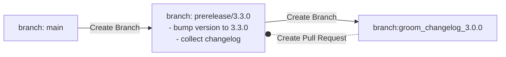
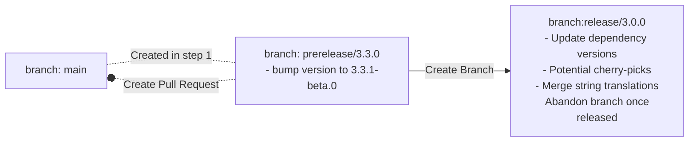

# Creating a Release

This document applies to beta and stable releases. Alpha releases are created nightly through a separate light-weight mechanism.

All new major/minor releases and new beta releases should be posted on the [internal releases Teams channel](https://teams.microsoft.com/l/channel/19%3ae12aa149c0b44318b245ae8c30365880%40thread.skype/ACS%2520Deployment%2520Announcements?groupId=3e9c1fc3-39df-4486-a26a-456d80e80f82&tenantId=72f988bf-86f1-41af-91ab-2d7cd011db47).

## Ensuring release quality

We must do due diligence in testing our packages before any new major/minor or beta release (alpha releases are exempt). To do so a release branch should be created at least 1 week before release and thoroughly bug bashed. All critical bugs must be fixed.

See the [release checklist](../references/release-checklist.md) for tasks that must be completed before releasing.

## Release workflow

Both beta and stable release follow a two step workflow, aided by github actions.

### Step 1: Create a Pre-release branch

We want to create a pre-release branch because this branch will act as a place to perform actions like bumping package versions, grooming the changelog, and performing string translations. This branch will be the place that the release branch is created from before it is merged back into main.

Use the [create-prerelease-branch](https://github.com/Azure/communication-ui-library/actions/workflows/create-prerelease-branch.yml) github action to trigger the release preparation workflow.

1. Options for this workflow:
    1. Branch - This is the branch that the release will be created from. Default option is from `main`.
    2. Bump Type - This is the type of release that will be created, the options for this are:
        - `beta` - You will want to select this option when you want to do a beta release e.g: `release/1.2.beta.1`
        - `stable-minor` - This option is best for when you want to release from `1.2.0 -> 1.3.0`
        - `stable-patch` - Choose this option when you want to release from `1.2.0 -> 1.2.1`

This workflow will:

1. Create a `prerelease/<release-tag>` branch, bump the package version for `@azure/communication-react` as appropriate and collect all change files into a changelog.
    1. This step will also create a file called `GROOMME.md` which should be deleted when completing the PR back into the pre-release branch to signify that the changelog has been manually groomed.
1. Create a Pull Request into the `prerelease/<release-tag>` for manually summarizing the changes collected in the changelog. *Merge this PR before going to step 2*.

For example, when creating a release off of `main` tagged `3.3.0`, the following branches and Pull Requests will be created:


* Following the conclusion of this workflow you will need to kick off [the string localization workflow](https://github.com/Azure/communication-ui-library/actions/workflows/run-td-build.yml) on the `pre-release` branch that results from this.

### Step 2: Create release branch

Use the [create-release-branch](https://github.com/Azure/communication-ui-library/actions/workflows/create-release-branch.yml) github action to trigger the release branch creation workflow.

String translations should have been updated in this branch 5 days before release. if they have not, run [translation workflow](https://github.com/Azure/communication-ui-library/actions/workflows/run-td-build.yml) in the pre-release branch and cherry pick the string changes into the release branch.

1. Options for GH Action:
    1. Pre-release branch - This is the pre-release branch that was created in the previous workflow. This action should be only done after the changelog is groomed and merged back into the pre-release branch to avoid cherry picking.

This workflow will:

1. Create a Pull Request to merge the prerelease branch back into the base branch.
    1. For stable release only: Before creating the Pull Request, @azure/communiation-react will be version bumped once again to a `-beta.0` version (this ensures that we can continue to add changes of `prerelease`) type.
1. Create a new release branch off of the prerelease branch. This branch will be used for the eventual release, but *it will never be merged back in the base branch*.
  1. On the release branch will check what kind of release this is, beta, stable-minor, or stable-patch. based on the selection here it will update the sdk versions.
  2. The action will synchronize the package telemetry verions on the release branch.
  3. After making these changes it will make a PR from the pre-release branch back into `main`.

Continuing the example above, this action should be triggered once `groom_changelog_3.0.0` is merged. It will create the following new branches and Pull Requests:


Something that should be done is disable the beta checks on the CI if a `stable` release. This is to ensure that any cherry pick PR's going into release dont run against the beta CI causing failures this is done by editing the [CI](https://github.com/Azure/communication-ui-library/actions/workflows/ci.yml) workflow Matrix definition. This can be done in this [file](../../.github/workflows/ci.yml) by editing the output `JSON` string to remove the `beta` flavor.

### Cherry-picking changes

While the release branch is active, some changes might be merged into the branch (for bug fixes, features deemed necessary for the release). PRs into the release branch should follow this process when possible:

- First land the change as a PR into `main`.
- Then, cherry-pick the change as a separate PR onto the release branch.
  - Do not merge changes into the prerelease branch created in Step #1. They may get merged after the release branch is created, and not make it into the release at all.
  - The release branch is never merged back into `main`, so any changes directly into the release branch will be lost on `main` (and future releases).

This process has the following benefits:

- The release branch never diverges off of `main`. In theory, it is possible to abandon the release branch at any point and create a new one off of `main` without losing work.
-  All PR reviews happen on `main`, and the cherry-pick PR simply requires a sign-off.

## Publishing the package

You are now ready to publish the package!

1. Run the "Publish npm packages" GitHub action _off the release branch_.
    * Enter the tag also, normally if releasing a new public version the tag name will be `latest`. A beta release would be `next` and an alpha release would be `dev`. However while our package has no major version and is in beta only, we use `latest` for the tag and not `next`. So for current beta releases be sure to use the tag `latest`.

        <https://user-images.githubusercontent.com/2684369/130102770-21da0fff-ffe3-42fb-8e80-d8a8761b8067.mp4>

1. This deployment must then be approved by one of the repo administrators:

    

1. Wait for the action to complete successfully then verify on <https://www.npmjs.com/> that the package(s) published successfully.
1. Complete the post-release verification steps in [Release Checklist](./release-checklist.md).
1. (If this is a latest release) Deploy the new version of storybook using the "Release branch - Publish Storybook" GitHub action.
1. Once everything is deployed and published on npm, delete the release branch from github. 

## Submitting a hotfix

There is currently no GitHub action for creating a hotfix and must be done manually.

1. Checkout the version you wish to fix

    ```bash
     git checkout <version-tag> # version tag will be something like v.1.2.3
    ```

1. Create a release branch from this

    ```bash
    git checkout -b hotfix/fix-security-flaw
    ```

1. Create a development branch from your release branch

    ```bash
    git checkout -b jaburnsi/chat-thread-security-patch
    ```

1. Make your changes as normal, commit your changes and put up a PR _into the release branch you made_. Ensure you specify `patch` when generating running `rush changelog`.

1. Once the PR is complete, hop onto the release branch in your terminal again (be sure to pull the latest changes that were merged into it)

    ```bash
    git checkout -b hotfix/fix-security-flaw
    git pull
    ```

1. Publish the package. _documentation to follow on publishing packages._

## Other release types

### Creating alpha releases

Alpha releases are created nightly using the [.github/workflows/nightly-ci.yml](https://github.com/Azure/communication-ui-library/blob/main/.github/workflows/nightly-ci.yml) GitHub action.

They use beachball's `canary` CLI command to temporarily set all package versions to \<version\>-alpha-yyyymmddHHMM, then package up the npm packages and upload the packages to the azure release pipeline.

### Creating beta releases

Creating a beta release is the same as creating a regular release, however each package.json version must have the `-beta` suffix and all changelogs must have `prerelease` or `none` as their change type. This will be typically during prerelease phases before a new major version is released.

To create a beta release, ensure the above conditions then follow the instructions for "Creating a release through GitHub actions" or "Manually creating a release".

## Publishing packages

To ensure our packages are part of the `@azure` organization our packages are published using [Azure's publishing pipeline](https://dev.azure.com/azure-sdk/internal/_wiki/wikis/internal.wiki/1/Partner-Release-Pipeline).

This requires us to first upload the tarball of the package we wish to publish to their blob storage, then trigger their release pipeline. This can be done manually or by GitHub actions.

Currently alpha package releases are entirely done through GitHub actions (see [.github/workflows/nightly-ci.yml](https://github.com/Azure/communication-ui-library/blob/main/.github/workflows/nightly-ci.yml)). This requires the use of internal keys and tokens. For more information on these, or how to update them, see: [Updating npm publishing credentials](../references/updating-npm-publishing-credentials.md).
