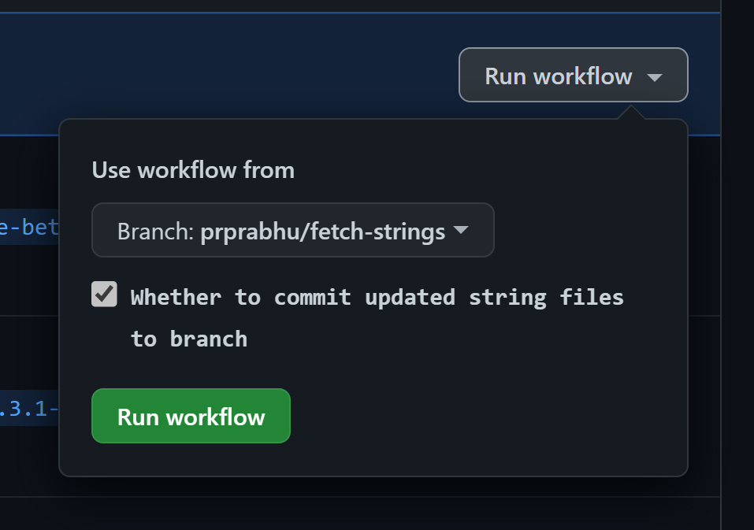

# String translations

[@azure/communication-react](https://www.npmjs.com/package/@azure/communication-react) includes translations of all strings used internally to a set of supported languages.

We use a Microsoft internal translation service for string translations. Strings are automatically sent for translation via a [GitHub action](https://github.com/Azure/communication-ui-library/actions/workflows/run-td-build.yml) on pushes to the `main`.

**Strings are not committed back into the repository automatically**. This is to avoid surprises due to mis-translated strings and so that test snapshots can be updated to reflect the new strings.

To fetch back strings:

* Create a new branch off of `main` and trigger the same [GitHub action](https://github.com/Azure/communication-ui-library/actions/workflows/run-td-build.yml).
* Pick your new branch to run the workflow and check the option to commit updated strings.
  
* Follow the [usual process](../contributing-guide/6.%20submitting-a-pr.md) for merging the PR into `main`.
* You _may_ need to add the `update_snapshots` label to the PR to update [e2e test snapshots](../references/ui-tests.md) if the e2e tests fail.

**Note**: String translation can take up to 5 working days to complete. Be careful when making (i.e., cherry-picking into a release branch) string changes close to a release.

Further reading: [Internal documentation](https://skype.visualstudio.com/SPOOL/_wiki/wikis/SPOOL.wiki/25949/Localization) for details on how string translation service is setup.
