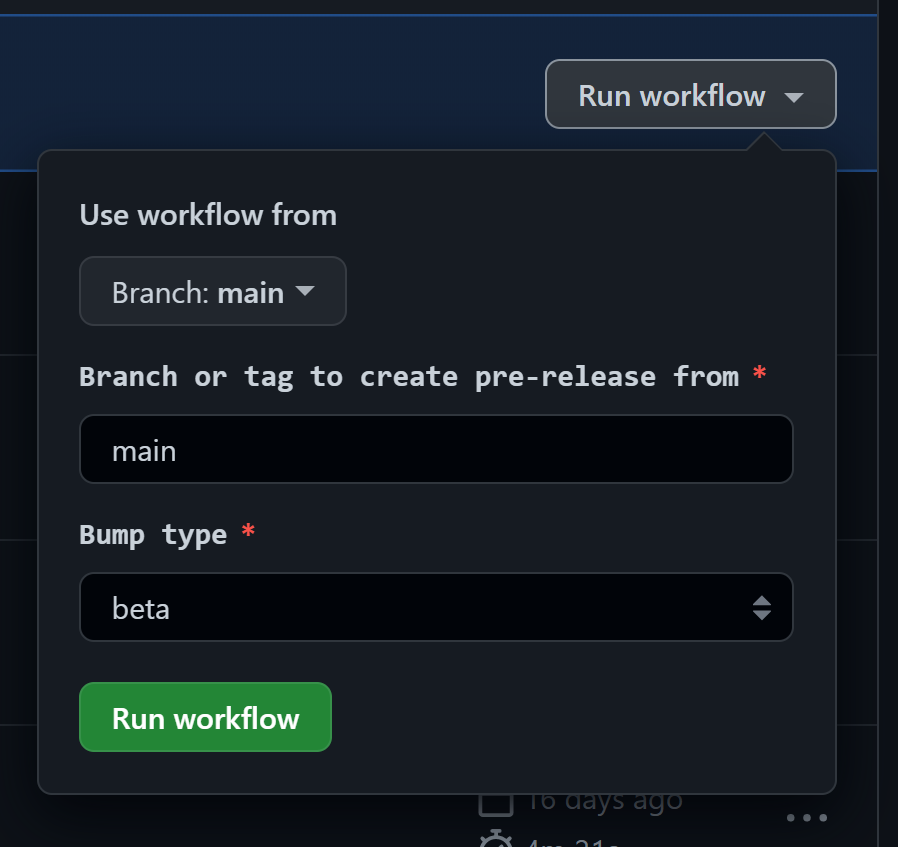
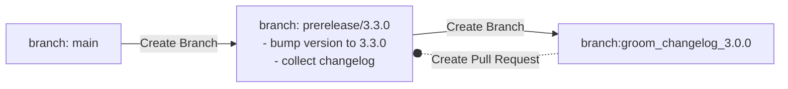
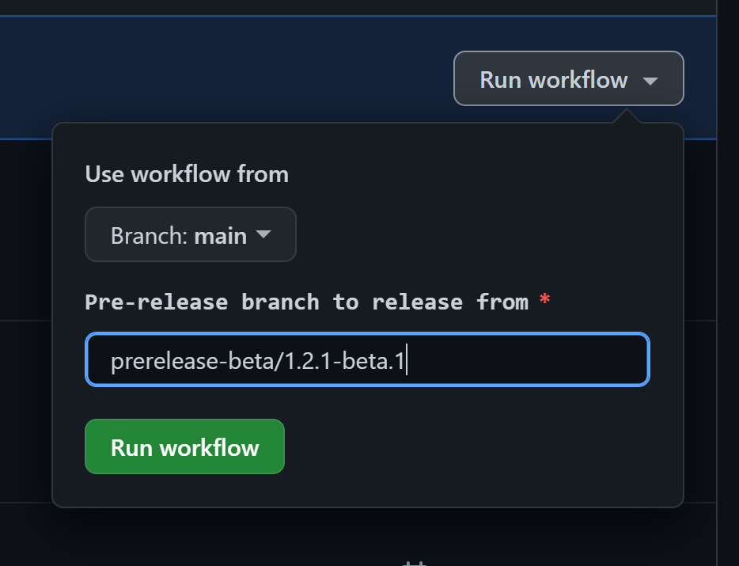
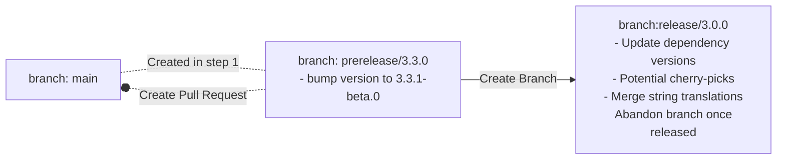
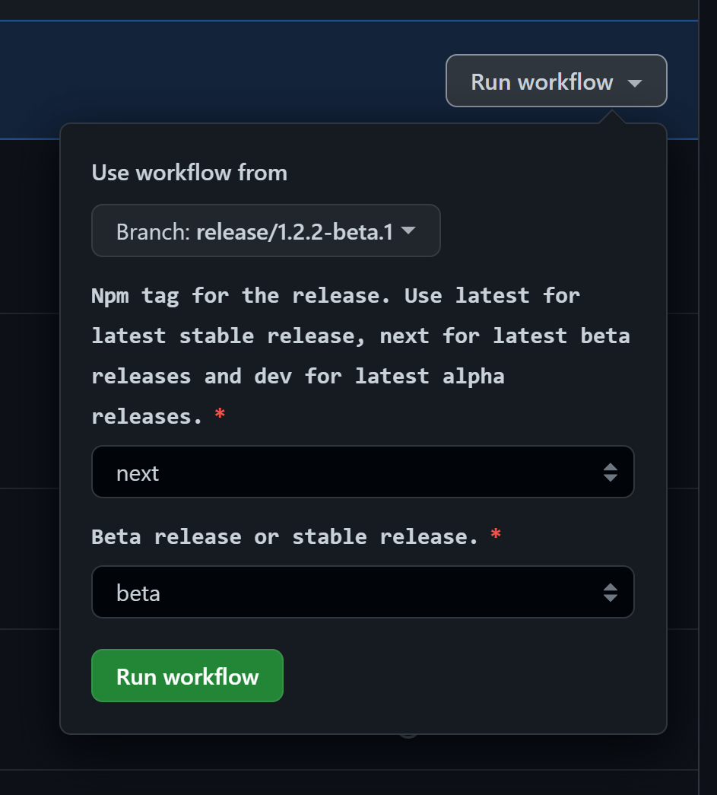
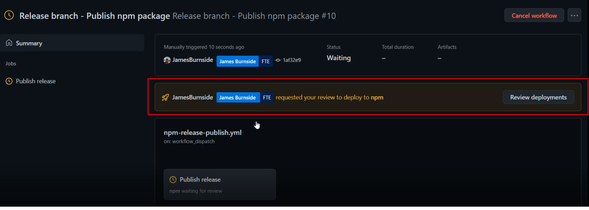
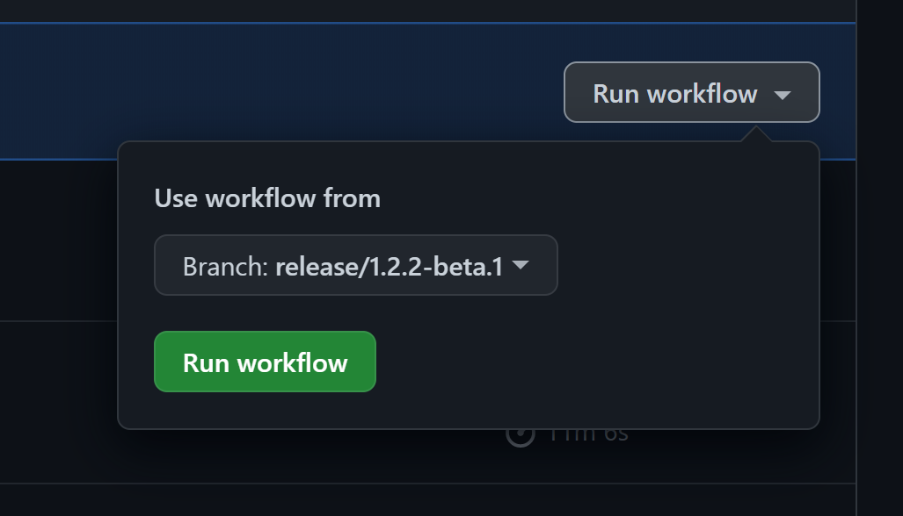

# Release process for @azure/communication-react

[@azure/communication-react](https://www.npmjs.com/package/@azure/communication-react) is the primary NPM package released from this repository.
Along with the NPM package, we also update the documentation hosted on [storybook](https://azure.github.io/communication-ui-library/).

This repository follows a green-trunk development model. All development happens on the `main` branch. Releasing a new version of the package involves three distinct steps:

1. [Create a git branch to release the package](#step-1-creating-a-release-branch). This step is mostly automated via GitHub workflows.
1. [Prepare the branch for release](#step-2-prepare-for-release). This step involves API approvals, string translations, bug bashes etc and tends to last 1-2 weeks.
1. [Release the package to NPM for release branch](#step-3-publish-to-npm). This step is mostly automated via GitHub workflows.

_This document applies to beta and stable releases. Alpha releases are created nightly through a separate [light-weight mechanism](#creating-alpha-releases)._

_This document applies to normal releases, off of `main`. For hotfixing a prior release on NPM, see [documentation on creating hotfixes](./hotfix-release.md)._

## Before creating a release branch

- Update the strings on `main` these [steps](../references/string-translations.md).
  - **Note**: String translation can take up to 5 working days to complete. It is a good idea to avoid string changes once before the release process

## Step 1: Creating a release branch

Both beta and stable release follow a two step workflow, aided by github actions.

### Step 1.1: Create a Pre-release branch

We want to create a pre-release branch because this branch will act as a place to perform actions like bumping package versions, grooming the changelog, and performing string translations. This branch will be the place that the release branch is created from before it is merged back into main.

Use the [create-prerelease-branch](https://github.com/Azure/communication-ui-library/actions/workflows/create-prerelease-branch.yml) github action to trigger the release preparation workflow.

1. Options for this workflow:
    1. Branch - This is the branch that the release will be created from. Default option is from `main`.
    2. Bump Type - This is the type of release that will be created, the options for this are:
        - `beta` - You will want to select this option when you want to do a beta release e.g: `release/1.2.beta.1`
        - `stable-minor` - This option is best for when you want to release from `1.2.0 -> 1.3.0`
        - `stable-patch` - Choose this option when you want to release from `1.2.0 -> 1.2.1`



#### Workflow details

This section describes what the workflow above does. Understanding the workflow actions is useful in case the workflow fails.

1. Create a `prerelease/<release-tag>` branch, bump the package version for `@azure/communication-react` as appropriate and collect all change files into a changelog.
1. Creates another branch for manually summarizing the changes collected in the changelog and ~~opens a Pull Request into the `prerelease/<release-tag>`~~ per [security policy](https://aka.ms/opensource/actions-changes-230217) you must open a PR manually of this new branch (`groom-changelog/<release-tag>`) into the prerelease branch (`prerelease/<release-tag>`). **Merge this PR before going to `Step 1.2: Create release branch`**.
    1. This step will also create a file called `GROOMME.md` which should be deleted when completing the PR back into the pre-release branch to signify that the changelog has been manually groomed.
    1. See [tips for how to prune the generated changelog](./pruning-a-changelog.md) into a readable summary of the release.

For example, when creating a release off of `main` tagged `3.3.0`, the following branches and Pull Requests will be created:



### Step 1.2: Create release branch

Use the [create-release-branch](https://github.com/Azure/communication-ui-library/actions/workflows/create-release-branch.yml) github action to trigger the release branch creation workflow.

1. Options for GH Action:
    1. Pre-release branch - This is the pre-release branch that was created in the previous workflow. This action should be only done after the changelog is groomed and merged back into the pre-release branch to avoid cherry picking.



#### Workflow details

This section describes what the workflow above does. Understanding the workflow actions is useful in case the workflow fails.

1. Create a Pull Request to merge the prerelease branch back into the base branch.
    1. For stable release only: Before creating the Pull Request, @azure/communiation-react will be version bumped once again to a `-beta.0` version (this ensures that we can continue to add changes of `prerelease`) type.
1. Create a new release branch off of the prerelease branch. This branch will be used for the eventual release, but **it will never be merged back in the base branch**.
  1. On the release branch will check what kind of release this is, beta, stable-minor, or stable-patch. based on the selection here it will update the sdk versions.
  2. The action will synchronize the package telemetry verions on the release branch.
  3. After making these changes it will make a PR from the pre-release branch back into `main`.

Continuing the example above, this action should be triggered once `groom_changelog_3.0.0` is merged. It will create the following new branches ~~and Pull Requests~~ (Pull requests must now be created manually per [security policy](https://aka.ms/opensource/actions-changes-230217)):



After running the action, the beta checks on the CI should be automatically disabled if this is a stable release. Inversely, the stable checks should be automatically disabled if this is a beta relase. This is to ensure that any cherry pick PR's going into release dont run against the wrong build flavor in CI causing failures. If the wrong build flavor checks were not automatically disabled, edit the [CI workflow](../../.github/workflows/ci.yml): Modify the output `JSON` string to remove the `beta` flavor for `stable` releases / `stable` flavor for `beta` releases.

## Step 2: Prepare for release

Once the release branch has been created, we must make sure that the package we eventually off of the release branch is high quality. Towards this:

- Setup a bug bash with the team to shake out any issues. See [internal documentation](https://skype.visualstudio.com/SPOOL/_wiki/wikis/SPOOL.wiki/31350/WebUI-Setting-up-a-bug-bash) for setting up a bug bash.
  - Triage bugs found via bug bash and manage merging of fixes into the release branch, as described in section below.
- For stable releases, or for "large" beta releases, we must get any API changes approved by the Azure REST API Stewardship board. See [internal documentation](https://skype.visualstudio.com/SPOOL/_wiki/wikis/SPOOL.wiki/27654/Scheduling-an-Azure-Review-Board-(ARB)-Review) for how to reach out to the API stewardship board.
- [Fetch translated strings](../references/string-translations.md) again for main to make sure any other string updates that have occured since the start of the release process are included. If there are any strings updated, [cherry-pick](#cherry-picking-changes) the changes to the release branch.

### Cherry-picking changes

While the release branch is active, some changes might be merged into the branch (for bug fixes, features deemed necessary for the release). PRs into the release branch should follow this process when possible:

- First land the change as a PR into `main`.
- Then, cherry-pick the change as a separate PR onto the release branch.
  - Do not merge changes into the prerelease branch created in Step #1. They may get merged after the release branch is created, and not make it into the release at all.
  - The release branch is never merged back into `main`, so any changes directly into the release branch will be lost on `main` (and future releases).

This process has the following benefits:

- The release branch never diverges off of `main`. In theory, it is possible to abandon the release branch at any point and create a new one off of `main` without losing work.
-  All PR reviews happen on `main`, and the cherry-pick PR simply requires a sign-off.

## Step 3: Publish to NPM

You are now ready to publish the package!

**Releasing to NPM is an irreversible action**.
Even though most of the steps necessary to release the package are automated via a GitHub workflow, you should run through the [checklist of pre and post release actions](./release-checklist.md) to take to ensure a confident release.

**Rule of two**: It is recommended to pair up with a team member for this last step to reduce the changes of human error.


1. Run the [Publish npm packages" GitHub action](https://github.com/Azure/communication-ui-library/actions/workflows/npm-release-publish.yml) **off the release branch**.
    - Pick the right tag: For stable release, pick `latest`, for beta release pick `next`.
    
1. This deployment must then be approved by one of the repo administrators:
    
1. Wait for the action to complete successfully then verify on <https://www.npmjs.com/> that the package(s) published successfully.
1. For *beta releases only*, also deploy the hosted storybook documentation using the ["Release branch - Publish Storybook" GitHub action](https://github.com/Azure/communication-ui-library/actions/workflows/deploy-storybook.yml).
    
1. Once everything is deployed and published on npm, delete the release branch from github.

## Step ∞

*For stable release only*, update the hero samples to use the newly released stable package. See [instructions for updating hero samples](./hero-samples.md).

Samples should be updated within a week of the package release.

# Appendix

## Releasing a hotfix for an older release

There is currently no GitHub action for creating a hotfix and must be done manually.

1. Checkout the version you wish to fix

    ```bash
     git checkout <version-tag> # version tag will be something like v.1.2.3
    ```

1. Create a release branch from this

    ```bash
    git checkout -b hotfix/fix-security-flaw
    ```

1. Create a development branch from your release branch

    ```bash
    git checkout -b jaburnsi/chat-thread-security-patch
    ```

1. Make your changes as normal, commit your changes and put up a PR _into the release branch you made_. Ensure you specify `patch` when generating running `rush changelog`.

1. Once the PR is complete, hop onto the release branch in your terminal again (be sure to pull the latest changes that were merged into it)

    ```bash
    git checkout -b hotfix/fix-security-flaw
    git pull
    ```

1. Publish the package. _documentation to follow on publishing packages._

## Creating alpha releases

Alpha releases are created nightly using the [.github/workflows/nightly-ci.yml](https://github.com/Azure/communication-ui-library/blob/main/.github/workflows/nightly-ci.yml) GitHub action.

They use beachball's `canary` CLI command to temporarily set all package versions to \<version\>-alpha-yyyymmddHHMM, then package up the npm packages and upload the packages to the azure release pipeline.

## NPM publish pipeline

To ensure our packages are part of the `@azure` organization our packages are published using [Azure's publishing pipeline](https://dev.azure.com/azure-sdk/internal/_wiki/wikis/internal.wiki/1/Partner-Release-Pipeline).

This requires us to first upload the tarball of the package we wish to publish to their blob storage, then trigger their release pipeline. This can be done manually or by GitHub actions.

Currently alpha package releases are entirely done through GitHub actions (see [.github/workflows/nightly-ci.yml](https://github.com/Azure/communication-ui-library/blob/main/.github/workflows/nightly-ci.yml)). This requires the use of internal keys and tokens. For more information on these, or how to update them, see: [Updating npm publishing credentials](../references/updating-npm-publishing-credentials.md).
