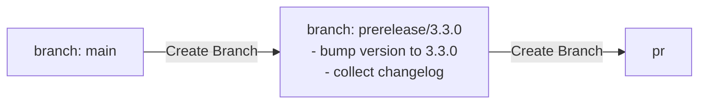

# Release process for @azure/communication-react

[@azure/communication-react](https://www.npmjs.com/package/@azure/communication-react) is the primary NPM package released from this repository.
Along with the NPM package, we also update the documentation hosted on [storybook](https://azure.github.io/communication-ui-library/).

This repository follows a green-trunk development model. All development happens on the `main` branch. Releasing a new version of the package involves three distinct steps:

1. [Create a git branch to release the package](#step-1-creating-a-release-branch). This step is mostly automated via GitHub workflows.
1. [Prepare the branch for release](#step-2-prepare-for-release). This step involves API approvals, string translations, bug bashes etc and tends to last 1-2 weeks.
1. [Release the package to NPM for release branch](#step-3-publish-to-npm). This step is mostly automated via GitHub workflows.

_This document applies to beta and stable releases. Alpha releases are created nightly through a separate [light-weight mechanism](#creating-alpha-releases)._

_This document applies to normal releases, off of `main`. For hotfixing a prior release on NPM, see [documentation on creating hotfixes](./hotfix-release.md)._

## Timeline

### First week of sprint

- [Step 0.1: Create a Thread in the WebUI channel to Track Release Progress](#step-01-create-a-thread-in-the-webui-channel-to-track-release-progress)
- [Step 0.2: Pre-Release ChangeLog and Update Feature List](#step-02-pre-release-changelog-and-update-feature-list)
- [Step 0.3: ARB Review of any Changes to Public SDK API and/or Rest APi (Required for Stable | Recommended for Beta)](#step-03-arb-review-of-any-changes-to-public-sdk-api-andor-rest-api-required-for-stable--recommended-for-beta)
- [Step 0.4: Create an Async Bug Bash Meeting](#step-04-create-an-async-bug-bash-meeting)
- [Step 0.5: Create a Change Log Grooming Meeting](#step-05-create-a-change-log-grooming-meeting)
- [Step 0.6: Ensure strings are Updated on Main](#step-06-ensure-strings-are-updated-on-main)

### Second week of sprint

#### Monday

- [Step 1.1: Create a Pre-release Branch](#step-11-create-a-pre-release-branch)
- [Step 1.2: Groom changelog](#step-12-groom-changelog)
- [Step 1.3: Create Release branch](#step-13-create-release-branch)
- [Step 1.4: (Beta Only): Update the UI Snapshot](#step-14-beta-only-update-the-ui-snapshot)
- [Step 1.5: (Beta Only): Notify the Release Thread About api.md Update and UI Snapshot Update](#step-15-beta-only-notify-the-release-thread-about-apimd-update-and-ui-snapshot-update)

#### Tuesday / Wednesday

- [Step 2.1: Bug Bash](#step-21-bug-bash)
- [Step 2.2: Storybook Bug Bash](#step-22-storybook-bug-bash)
- [Step 2.3: Fetch, Merge and Cherry-pick Translated Strings](#step-23-fetch-merge-and-cherry-pick-translated-strings)

#### Thursday

- [Step 3.1: Pre-release Checklist](#step-31-pre-release-checklist)
- [Step 3.2: Publish to NPM (Pair up with a teammate)](#step-32-publish-to-npm-pair-up-with-a-teammate)
- [Step 3.3: (Beta Only): Deploy Storybook](#step-33-beta-only-deploy-storybook)
- [Step 3.4: Clean up and Merge Pre-Release Branch Back to Main](#step-34-clean-up-and-merge-pre-release-branch-back-to-main)
- [Step 3.5: Post-release Checklist](#step-35-post-release-checklist)

## Step 0: Preparation

### Step 0.1: Create a Thread in the WebUI channel to Track Release Progress

Create a release thread in the WebUI channel and keep it up to date so the whole team knows where we are at.

### Step 0.2: Pre-Release ChangeLog and Update Feature List

Ask feature owners to create a PR to add a pre-release changelog and remove the feature from the in-progress-feature/feature list.

For all the features that are going into this release, ask the feature owners to:

- Move feature to beta or stable as appropriate in the [feature list](../../common/config/babel/features.js)
- Create a change log summarizing the feature and set the change type as 'prerelease' if the feature is going into beta, or 'minor' if the feature is going into stable.
  
[Shiproom Dashboard](https://skype.visualstudio.com/SPOOL/_dashboards/dashboard/c38163f7-e172-4afa-a4c2-76e888b5cddc)

### Step 0.3: ARB Review of any Changes to Public SDK API and/or Rest APi (Required for Stable | Recommended for Beta)

1. [Create an APIView](https://skype.visualstudio.com/SPOOL/_wiki/wikis/SPOOL.wiki/48971/Creating-an-APIView) showing changes.
1. Create a post in `Language - JavaScript - Reviews` channel with APIView link to request review.
    1. Use a previous review request as an example.
1. See the [internal documentation](https://skype.visualstudio.com/SPOOL/_wiki/wikis/SPOOL.wiki/27654/Scheduling-an-Azure-Review-Board-%28ARB%29-Review) for how to reach out to the API stewardship board.
1. Follow up after 24-48 hours if you have not received a response.

### Step 0.4: Create an Async Bug Bash Meeting

Ex.

### Step 0.5: Create a Change Log Grooming Meeting

Setup a meeting with the feature owners to groom the changelog together.

### Step 0.6: Ensure Strings are updated on Main

- String translation take up to 5 working days to complete. **Any PR changing strings needs to be complete 5 working days before release.**
- [Ensure any strings PRs are merged into `main`](../references/string-translations.md)

## Step 1: Creating a Release Branch

Both beta and stable releases follow a two-step workflow, aided by GitHub actions.

### Step 1.1: Create a Pre-release Branch

We want to create a pre-release branch because this branch will act as a place to perform actions like bumping package versions, grooming the changelog, and performing string translations. This branch will be the place that the release branch is created from before it is merged back into main.

Use the [create-prerelease-branch](https://github.com/Azure/communication-ui-library/actions/workflows/create-prerelease-branch.yml) GitHub action to trigger the release preparation workflow.

1. Options for this workflow:
    1. Branch - This is the branch that the release will be created from. Default option is from `main`.
    1. **Note:** Get current version from [communication-react package.json](https://github.com/Azure/communication-ui-library/blob/main/packages/communication-react/package.json).
    1. Use this version as the basis for making your decision in the next step.
    1. Bump Type - This is the type of release that will be created, the options for this are:
        - `beta-release-major` - Choose this option when you want to release from `1.2.0 -> 2.0.0-beta.1`
        - `beta-release-minor` - Choose this option when you want to release from `1.2.0 -> 1.3.0-beta.1` or `1.2.0-beta.3 -> 1.3.0-beta.1`
        - `beta-release-patch` - Choose this option when you want to release from `1.2.0 -> 1.2.1-beta.1` or `1.2.0-beta.3 -> 1.2.1-beta.1`
        - `beta-release-beta` - Choose this option when you want to update only beta version to release from `1.2.0.beta.1 -> 1.2.0-beta.2`
        - `stable-major` - This option is best for when you want to release from `1.2.0 -> 2.0.0`
        - `stable-minor` - This option is best for when you want to release from `1.2.0 -> 1.3.0`
        - `stable-patch` - Choose this option when you want to release from `1.2.0 -> 1.2.1`
        - `stable-remove-beta-suffix` - Choose this option when you want to release from `1.2.0-beta.3 -> 1.2.0`

#### Workflow Details

This section describes what the workflow above does. Understanding the workflow actions is useful in case the workflow fails.

1. Create a `prerelease/<release-tag>` branch, bump the package version for `@azure/communication-react` as appropriate and collect all change files into a changelog.
1. Creates another branch for manually summarizing the changes collected in the changelog.

For example, when creating a release off of `main` tagged `3.3.0`, the following branches are created

Once this workflow is done you will need to go to the new branch when making a PR and manually create a 
change file stating that the versions of the packages have been bumped.

### Step 1.2: Groom changelog

1. Previous step's workflow creates a `groom-changelog/<release-tag>` branch.
1. Follow steps to [groom changelog](./pruning-a-changelog.md).
1. Remove the `GROOMME.md` file created from previous workflow to signify that the changelog has been manually groomed.
1. Create PR to merge grooming branch into pre-release branch (`prerelease/<release-tag>`).
1. **Merge this PR before going to `Step 1.3: Create release branch`**.

### Step 1.3: Create Release branch

Use the [create-release-branch](https://github.com/Azure/communication-ui-library/actions/workflows/create-release-branch.yml) github action to trigger the release branch creation workflow.

1. Options for GH Action:
    1. Pre-release branch - This is the pre-release branch that was created in the previous workflow. This action should be only done after the changelog is groomed and merged back into the pre-release branch to avoid cherry-picking.

### Step 1.4 (Beta Only): Update the UI Snapshot

After finishing creating a release branch, follow these steps to create a UI snapshot PR (generate beta-release only snapshot diff from main branch):

1. Create a new branch based on the release branch you just created in Step 1.2
1. Use the [update-snapshots](https://github.com/Azure/communication-ui-library/actions/workflows/update-snapshots.yml) github action to trigger the update snapshots workflow. 
1. Wait for snapshot update
1. Once the snapshot update is finished, you might or might not see changes for the UI snapshot, if there are any updates, open a PR to merge that new branch back to the release branch
1. Merge the PR if everything looks fine, or notify the feature owner if something looks not 100% correct.

## Step 2: Prepare for Release

### Step 2.1: Bug Bash

Once the release branch has been created, we must make sure that the package we eventually off of the release branch is high quality. Towards this:

- Set up a bug bash with the team to shake out any issues. See [internal documentation](https://skype.visualstudio.com/SPOOL/_wiki/wikis/SPOOL.wiki/31350/WebUI-Setting-up-a-bug-bash) for setting up a bug bash.
  - Triage bugs found via bug bash and manage merging of fixes into the release branch, as described in the section below.

#### Cherry-picking Changes

While the release branch is active, some changes might be merged into the branch (for bug fixes, or features deemed necessary for the release). PRs into the release branch should follow this process when possible:

- First land the change as a PR into `main`.
- Then, cherry-pick the change as a separate PR onto the release branch.
  - Do not merge changes into the prerelease branch created in Step #1. They may get merged after the release branch is created, and not make it into the release at all.
  - The release branch is never merged back into `main`, so any changes directly into the release branch will be lost on `main` (and future releases).

This process has the following benefits:

- The release branch never diverges off of `main`. In theory, it is possible to abandon the release branch at any point and create a new one off of `main` without losing work.
- All PR reviews happen on `main`, and the cherry-pick PR simply requires a sign-off.

### Step 2.2: Storybook Bug Bash
We must ensure that our documentation is of high quality. To achieve this, we need to thoroughly test the Storybook pages:

- Set up a bug bash with the team to shake out any issues. See [internal documentation](https://skype.visualstudio.com/SPOOL/_wiki/wikis/SPOOL.wiki/57179/WebUI-Setting-up-a-Storybook-bug-bash) for setting up a bug bash.
- Triage bugs found via bug bash and manage merging of fixes into the release branch, as described in the section below.

### Step 2.3: Fetch, Merge and Cherry-pick Translated Strings

[Fetch translated strings](https://github.com/Azure/communication-ui-library/blob/main/docs/references/string-translations.md) again for main to make sure any other string updates that have occurred since the start of the release process are included. If there are any strings updated, cherry-pick the changes to the release branch.

## Step 3: Publish to NPM

You are now ready to publish the package!

### Step 3.1: Pre-release Checklist

**Releasing to NPM is an irreversible action**.

Run through the [checklist of pre-release actions](./release-checklist.md)

### Step 3.2: Publish to NPM (Pair up with a teammate)

**Rule of two**: It is recommended to pair up with a team member for this last step to reduce the chances of human error.

1. Run the [Publish npm packages" GitHub action](https://github.com/Azure/communication-ui-library/actions/workflows/npm-release-publish.yml) **off the release branch**.
    - Pick the right tag: For stable release, pick `latest`, for beta release pick `next`.
    
1. This deployment must then be approved by one of the repo administrators:
    
1. Wait for the action to complete successfully then verify on <https://www.npmjs.com/> that the package(s) published successfully.

### Step 3.3 (Beta Only): Deploy Storybook

Deploy the hosted storybook documentation using the ["Release branch - Publish Storybook" GitHub action](https://github.com/Azure/communication-ui-library/actions/workflows/deploy-storybook.yml).

### Step 3.4: Clean up and Merge Pre-Release Branch Back to Main

1. Once everything is deployed and published on npm, delete the release branch from Git Hub.
1. Make a PR to merge the pre-release branch into main.

### Step 3.5: Post-release Checklist

Run through the [checklist of post-release actions](./release-checklist.md)

## Step ∞ (Stable Only): Update Hero Samples

Update the hero samples to use the newly released stable package. See [instructions for updating hero samples](./hero-samples.md).

Samples should be updated within a week of the package release.

## Appendix

### Releasing a hotfix for an older release

There is a separate process for releasing a hotfix. See [documentation on creating hotfixes](./hotfix-release.md).

### Creating alpha releases

Alpha releases are created nightly using the [.github/workflows/nightly-ci.yml](https://github.com/Azure/communication-ui-library/blob/main/.github/workflows/nightly-ci.yml) GitHub action.

Alpha releases can also be created manually by running [.github/workflows/alpha-release.yml](https://github.com/Azure/communication-ui-library/blob/main/.github/workflows/alpha-release.yml) GitHub action.

They use Beachball's `canary` CLI command to temporarily set all package versions to \<version\>-alpha-yyyymmddHHMM, then package up the npm packages and upload the packages to the azure release pipeline.

### NPM publish pipeline

To ensure our packages are part of the `@azure` organization our packages are published using [Azure's publishing pipeline](https://dev.azure.com/azure-sdk/internal/_wiki/wikis/internal.wiki/1/Partner-Release-Pipeline).

This requires us to first upload the tarball of the package we wish to publish to their blob storage, then trigger their release pipeline. This can be done manually or by GitHub actions.

Currently, alpha package releases are entirely done through GitHub actions (see [Nightly](https://github.com/Azure/communication-ui-library/blob/main/.github/workflows/nightly-ci.yml) and [Manual](https://github.com/Azure/communication-ui-library/blob/main/.github/workflows/alpha-release.yml) GitHub workflow for more details). This requires the use of internal keys and tokens. For more information on these, or how to update them, see: [Updating npm publishing credentials](../references/updating-npm-publishing-credentials.md).
