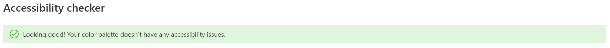

import { Meta } from '@storybook/addon-docs';
import { Canvas, Description, Heading, Props, Source, Title } from '@storybook/addon-docs';

import FluentThemeProviderSnippetText from '!!raw-loader!./snippets/FluentThemeProvider.snippet.tsx';
import { FluentThemeProviderSnippet } from './snippets/FluentThemeProvider.snippet';
import DarkControlBarText from '!!raw-loader!./snippets/DarkControlBar.snippet.tsx';
import { DarkControlBar } from './snippets/DarkControlBar.snippet';
import ThemedButtonText from '!!raw-loader!./snippets/ThemedButton.snippet.tsx';
import { ThemedButton } from './snippets/ThemedButton.snippet';

import {
  CameraButton,
  ControlBar,
  EndCallButton,
  FluentThemeProvider,
  MicrophoneButton,
  OptionsButton,
  ScreenShareButton,
  darkTheme
} from '@azure/communication-react';

<Meta id="theming" title="Concepts/Theming" />

# Theming

ACS UI SDK use components and icons from both [Fluent UI](https://developer.microsoft.com/fluentui#/controls/web)
and [Fluent React Northstar](https://fluentsite.z22.web.core.windows.net). The `FluentThemeProvider`
component ensures:

1. ACS UI SDK and Fluent UI components and icons are themed together
2. Fluent React Northstar icons are provided

## Usage

To use the FluentThemeProvider, simply import it from `@azure/communication-react` and wrap it around
ACS UI SDK components and Fluent UI components. For the example below we will provide theming and icons to
the `ControlBar`.

<Source code={FluentThemeProviderSnippetText} />

<Canvas withSource="none">
  <FluentThemeProviderSnippet />
</Canvas>

`FluentThemeProvider` does two things here:

1. `FluentThemeProvider` loads the icons used by components such as `CameraButton`
2. `FluentThemeProvider` applies theme (light theme by default) to the `ControlBar`

To illustrate how another theme can be applied, import `darkTheme` from `@azure/communication-react`
and assign it to the `fluentTheme` property.

<Source code={DarkControlBarText} />

<Canvas withSource="none">
  <DarkControlBar />
</Canvas>

The dark theme is applied to the `ControlBar`. The icon colors in the predefined button components are themed correctly
because they are built using the `DefaultButton` Fluent UI component.

## FluentThemeProvider Props

<Props of={FluentThemeProvider} />

## Creating your own theme

If you wish to use your own theme, we strongly advise using Microsoft's [Fluent UI Theme Designer](https://aka.ms/themedesigner).
Please ensure that the Accessibility checker on the same page passes when creating your own theme.



The default light theme we export looks like this:

```typescript
export const lightTheme = {
  palette: {
    themePrimary: '#0078d4',
    themeLighterAlt: '#f3f9fd',
    themeLighter: '#d0e7f8',
    themeLight: '#a9d3f2',
    themeTertiary: '#5ca9e5',
    themeSecondary: '#1a86d9',
    themeDarkAlt: '#006cbe',
    themeDark: '#005ba1',
    themeDarker: '#004377',
    neutralLighterAlt: '#faf9f8',
    neutralLighter: '#f3f2f1',
    neutralLight: '#edebe9',
    neutralQuaternaryAlt: '#e1dfdd',
    neutralQuaternary: '#d0d0d0',
    neutralTertiaryAlt: '#c8c6c4',
    neutralTertiary: '#a19f9d',
    neutralSecondary: '#605e5c',
    neutralPrimaryAlt: '#3b3a39',
    neutralPrimary: '#323130',
    neutralDark: '#201f1e',
    black: '#000000',
    white: '#ffffff'
  }
};
```

## Custom Theme Mapping

The ACS UI SDK and Fluent UI components automatically handles the mapping of palette slots to components.
If you wish to override the mapping, we advise that you use the `useTheme` hook.

<Source code={ThemedButtonText} />

<Canvas withSource="none">
  <ThemedButton />
</Canvas>

Should you override your own mappings, please note that ACS SDK UI components abide by the general Fluent UI
mappings. Foreground colors are used for text, icons, and outlines while background colors for component
backgrounds. Primary colors are also used for component backgrounds or icons.

## Custom Fonts

Custom Fonts can be applied to UI Components or Composites using the existing theming mechansim.
Along with the ability to change colors, a JSON object containing the theme palette also allows users to specify custom fonts.
As long as the fonts have been loaded in the application, a custom font name can be specified as shown in the example below.

```tsx
export const lightTheme = {
  defaultFontStyle: { fontFamily: 'Monaco, Menlo, Consolas', fontWeight: 'regular' },
  palette: {
    themePrimary: '#0078d4',
    themeLighterAlt: '#f3f9fd'
  }
};
```

If you wish to apply the same font to all the font weights, simply remove the `fontWeight` property from the `defaultFontStyle` object.
