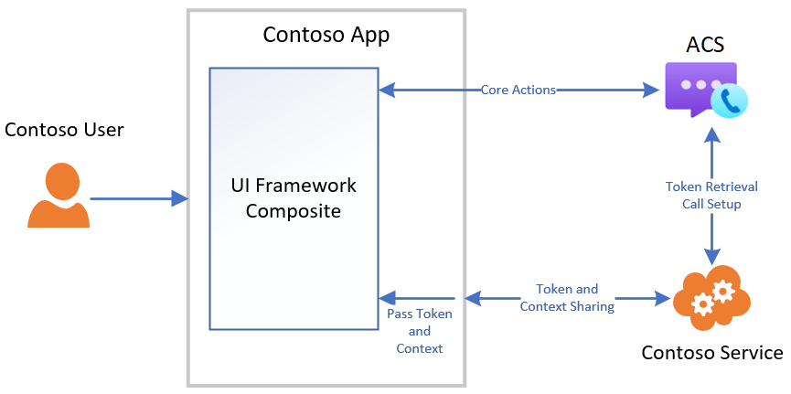

import { Meta } from '@storybook/addon-docs/blocks';
import { Canvas, Description, Heading, Props, Source, Title } from '@storybook/addon-docs/blocks';

<Meta title="Use Cases" />

# UI Toolkit Use Cases

Calling:

- Join Azure Communication Services call with Group Id

Chat:

- Join Azure Communication Services chat with Thread Id

## Capabilities

| Feature                                                             | Group Calling Composite | Group Chat Composite | Base Components |
| ------------------------------------------------------------------- | ----------------------- | -------------------- | --------------- |
| Join Teams Meeting                                                  | ✔                       |                      | ✔               |
| Join Teams Live Event                                               |                         |                      |
| Start VoIP call to Teams user                                       |                         |                      |
| Join a Teams Meeting Chat                                           |                         | ✔                    | ✔               |
| Join Azure Communication Services call with Group Id                | ✔                       |                      | ✔               |
| Start a VoIP call to one or more Azure communication Services users |                         |                      |
| Join an Azure Communication Services chat thread                    |                         | ✔                    | ✔               |
| Mute/unmute call                                                    | ✔                       |                      | ✔               |
| Video on/off on call                                                | ✔                       |                      | ✔               |
| Screen Sharing                                                      | ✔                       |                      | ✔               |
| Participant gallery                                                 | ✔                       |                      | ✔               |
| Microphone management                                               | ✔                       |                      | ✔               |
| Camera management                                                   | ✔                       |                      | ✔               |
| Call Lobby                                                          |                         |                      | ✔               |
| Send chat message                                                   |                         | ✔                    |
| Receive chat message                                                |                         | ✔                    | ✔               |
| Typing Indicators                                                   |                         | ✔                    | ✔               |
| Read Receipt                                                        |                         | ✔                    | ✔               |
| Participant List                                                    |                         |                      | ✔               |

## Supported identities:

An Azure Communication Services identity is required to initialize the UI Framework and authenticate to the service. For more information on authentication, see [Authentication](../authentication.md) and [Access Tokens](../../quickstarts/access-tokens.md)

## Customization

| Component Type      | Theming              | Styling                              | Icons                                 | Layout                                                                                  | Data Models                          |
| ------------------- | -------------------- | ------------------------------------ | ------------------------------------- | --------------------------------------------------------------------------------------- | ------------------------------------ |
| Composite Component | Fluent based Theming | N/A                                  | N/A                                   | Grid and Call Control layout configurable                                               | Composite-level data model injection |
| Base Component      | Fluent based Theming | Component specific styling using CSS | Component specific icon customization | Composable layout of components. Support for Grid and Call Control layout configuration | Component-level data model injection |

## Recommended architecture

Composite and Base Components are initialized using an Azure Communication Services access token. Access tokens should be procured from Azure Communication Services through a
trusted service that you manage. See [Quickstart: Create Access Tokens](https://docs.microsoft.com/azure/communication-services/quickstarts/access-tokens?pivots=programming-language-javascript) and [Trusted Service Tutorial](https://docs.microsoft.com/azure/communication-services/tutorials/trusted-service-tutorial) for more information.

These client libraries also require the context for the call or chat they will join. Similar to user access tokens, this context should be disseminated to clients via your own trusted service. The list below summarizes the initialization and resource management functions that you need to operationalize.

| Contoso Responsibilities                                 | UI Framework Responsibilities                                   |
| -------------------------------------------------------- | --------------------------------------------------------------- |
| Provide access token from Azure                          | Pass through given access token to initialize components        |
| Provide refresh function                                 | Refresh access token using developer provided function          |
| Retrieve/Pass join information for call or chat          | Pass through call and chat information to initialize components |
| Retrieve/Pass user information for any custom data model | Pass through custom data model to components to render          |

## Platform support

| SDK    | Windows            | macOS                | Ubuntu   | Linux    | Android  | iOS        |
| ------ | ------------------ | -------------------- | -------- | -------- | -------- | ---------- |
| UI SDK | Chrome\*, new Edge | Chrome\*, Safari\*\* | Chrome\* | Chrome\* | Chrome\* | Safari\*\* |

\*Note that the latest version of Chrome is supported in addition to the
previous two releases.

\*\*Note that Safari versions 13.1+ are supported. Outgoing video for Safari
macOS is not yet supported, but it is supported on iOS. Outgoing screen sharing
is only supported on desktop iOS.
