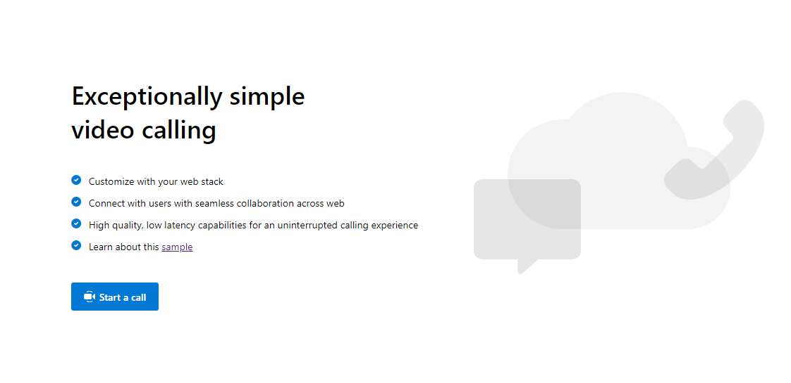
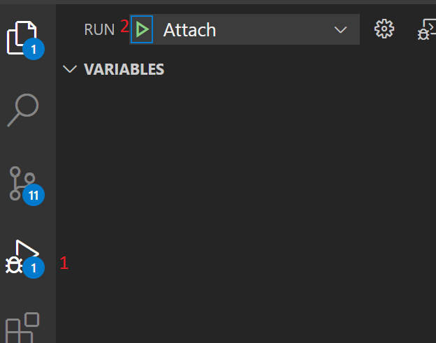

# Calling Sample

This is a sample application to show how the ACS Calling Web SDK can be used to build a calling experience.
The client-side application is a React based user interface leveraging Microsoft Fluent UI.
Powering this front-end is a NodeJS web application powered by ExpressJS to connect this application with Azure Communication Services.s.

Additional documentation for this sample can be found on [Microsoft Docs](https://docs.microsoft.com/azure/communication-services/samples/calling-hero-sample).

## Prerequisites

- Create an Azure account with an active subscription. For details, see [Create an account for free](https://azure.microsoft.com/free/?WT.mc_id=A261C142F).
- [Node.js (12.18.4 and above)](https://nodejs.org/en/download/)
- [Visual Studio Code (Stable Build)](https://code.visualstudio.com/Download)
- Create an Azure Communication Services resource. For details, see [Create an Azure Communication Resource](https://docs.microsoft.com/en-us/azure/communication-services/quickstarts/create-communication-resource). You'll need to record your resource **connection string** for this quickstart.

## Code structure

- ./Calling: frontend client
  - ./Calling/src
    - ./Calling/src/Components : React components to help build the client app calling experience
    - ./Calling/src/Containers : Connects the redux functionality to the React components
    - ./Calling/src/Core : Containers a redux wrapper around the ACS Web Calling SDK
  - ./src/index.js : Entry point for the client app
- ../Server/routes : Server app core logic for client app to get a token and to join a thread
- ../Server/app.ts: Server app startup logic

## Before running the sample for the first time

1. Open an instance of PowerShell, Windows Terminal, Command Prompt or equivalent and navigate to the directory that you'd like to clone the sample to.
2. `git clone https://github.com/Azure/Communication.git`
3. Get the `Connection String` from the Azure portal. For more information on connection strings, see [Create an Azure Communication Resources](https://docs.microsoft.com/azure/communication-services/quickstarts/create-communication-resource)
4. Once you get the `Connection String`, add the connection string to the **Server/appsetting.json** file found under the Calling folder. Input your connection string in the variable: `ResourceConnectionString`.

## Local run

1. Go to the Calling folder
2. `npm run setup:all`
3. `npm run start` (This will open a client server on port 3000 and an api server on port 8080)

## Production run

1. Go to Calling folder
2. `npm run setup:all`
3. `npm run build:prod`
4. `npm run start` (Locally this will be 8080, on Azure it will be whatevert port is provided through process.env.PORT)

### Troubleshooting

1. Solution doesn\'t build, it throws errors during NPM installation/build

   Run npm install

### Debugging

## On the server

1. from the Calling folder, run `npm run start:debug`
2. Click `run` on the side pane and select `attached`
   
3. Set your breakpoints on the server code

- Run the code and see the breakpoints get hit

## on the client

1. from the Calling folder, run `npm run start:debug`
2. Set breakpoints in your browser

- Run the code and the breakpoints should get hit

## Additional Reading

- [Azure Communication Calling SDK](https://docs.microsoft.com/azure/communication-services/concepts/voice-video-calling/calling-sdk-features) - To learn more about the calling web sdk
- [FluentUI](https://developer.microsoft.com/en-us/fluentui#/) - Microsoft powered UI library
- [React](https://reactjs.org/) - Library for building user interfaces
- [ASP.net Core](https://docs.microsoft.com/en-us/aspnet/core/introduction-to-aspnet-core?view=aspnetcore-3.1) - Framework for building web applications
- [Create-React-App](https://create-react-app.dev/) - Boilerplate React code to help with a majority of React style single page applications.
