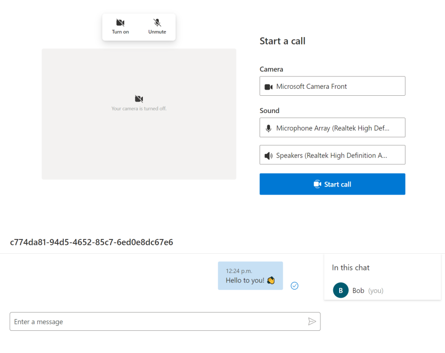

# Basic sample for using UI Composites on a plain HTML page

This sample shows how to embed the ready-to-use Calling, Chat, and CallWithChat composite components on your plain HTML page with a `<script>` tag. This is for you if your web app is not a React application but you still want to use our React components. The React parts are being hidden away behind helper functions inside a JavaScript bundle. The sample consists of the following files:

- `callComposite.js` exports a loadCallComposite function that uses React to render the UI Composite into a container HTML element.
- `chatComposite.js` exports a chatComposite function that uses React to render the UI Composite into a container HTML element.
- `callWithChatComposite.js` exports a loadCallWithChatComposite function that uses React to render the UI Composite into a container HTML element.
- `services.js` are helpers to create a user and a token, as well as to create a chat thread and add the user to the thread. This sample makes requests to the `samples/Server`. In real-life you have to write your own minimal authenticated server.
- `webpack.config.js` bundles the scripts so that they can be included on your web page.
- `index.html` loads the script bundle, and instantiates the composites with the helper functions.

> *Note:* As for all Azure Communication Services applications, you will still need to write your own production service for secure [management of users and tokens](https://docs.microsoft.com/azure/communication-services/quickstarts/access-tokens?pivots=programming-language-javascript).

## Prerequisites

- An [Azure subscription](https://azure.microsoft.com/free/).
- An existing Communication Services resource, or [create one](https://docs.microsoft.com/azure/communication-services/quickstarts/create-communication-resource).

## Commands

### Install dependencies

```sh
rush update:beta
```

### Bundle the app

```sh
rushx build
```

### Set your app settings

1. Get the `Connection String` from the Azure portal. For more information on connection strings, see [Create an Azure Communication Resources](https://docs.microsoft.com/azure/communication-services/quickstarts/create-communication-resource)
1. Once you get the `Connection String`, add the connection string to the **samples/Server/appsetting.json** file. Input your connection string in the variable: `ResourceConnectionString`.
1. Once you get the `Endpoint`, add the endpoint string to the **samples/Server/appsetting.json** file. Input your connection string in the variable: `EndpointUrl`.
1. Get the `identity` from the Azure portal. Click on `Identities & User Access Tokens` in Azure portal. Generate a user with `Chat` scope.
1. Once you get the `identity` string, add the identity string to the **samples/Server/appsetting.json** file. Input your identity string in the variable: `AdminUserId`. This is the server user to add new users to the chat thread.

### Launch the servers
```
rushx start
```

The basic app is accessible on http://localhost:3000.

## Note about package versions

>  This sample uses the `@azure/communication-react` package from within this repo, which can slightly diverge from the `latest` package on npm. If you copy this sample to bootstrap your own app and use the public npm package, you might need to fix the call signatures in the composite js file (e.g callWithChatComposite.js). Alternatively, you can install the `dev` tagged package from npm which is updated daily and should likely match the in-repo version.


## Generate composite js bundles
```
rushx build
```
Get your own bundle according to the need:
dist/chatComposite.js
dist/callComposite.js
dist/callWithChatComposite.js

Please check index.html for sample code for these 2 composites

## Basic app


